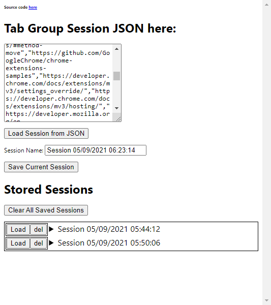

# Chrome Tab Groups Exporter

Very simplistic chrome extension to save tab groups as sessions. Export/Import sessions as JSON file.

## How to install?

Get released `.crx` from [releases](https://github.com/parthpower/chrome-tab-group-exporter/releases) page.

## Screenshot

**TODO** add `gif` here

## Make changes

- Clone this repository `git clone https://github.com/parthpower/chrome-tab-group-exporter`
- Edit files
- Go to [chrome://extensions](chrome://extensions)
- Enable developer mode
- Click on `Load unpacked` and select directory of this project

For details go to Chrome extensions docs [here](https://developer.chrome.com/docs/extensions/)

## Why this isn't on ChromeWeb Store?

Maybe will publish it there if need be.

## Are you actually using this?

Yes! I needed something quick to store my chrome sessions and move those around without creating accounts and what not. UX/UI aren't the best, App logic isn't the most optimized or even good from any point. Why? Because I just needed something done ASAP, can fix things later if need be.

## Contributing

This is just a useful tool I made in an hour or two. If you are using this and need help or have feature requests, please create an [issue](https://github.com/parthpower/chrome-tab-group-exporter/issues) or post it on [discussions](https://github.com/parthpower/chrome-tab-group-exporter/discussions)

Merge requests are always appreciated